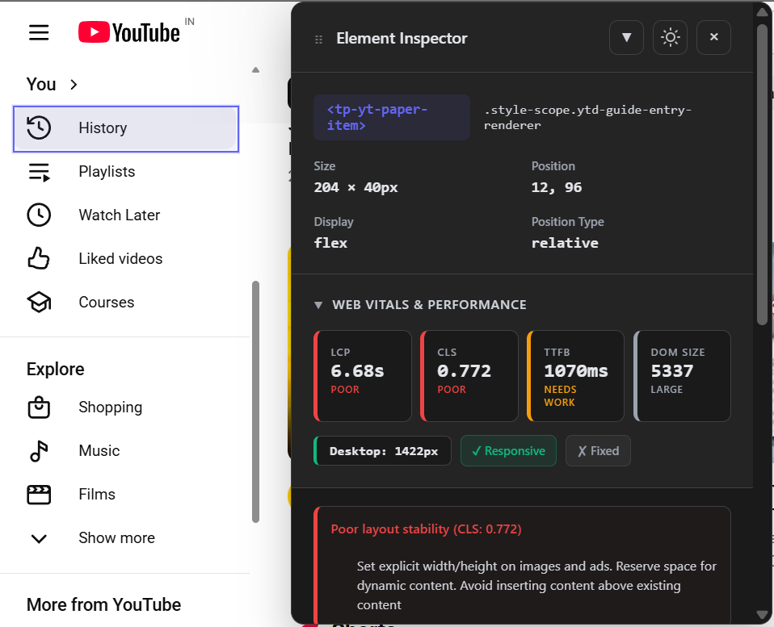
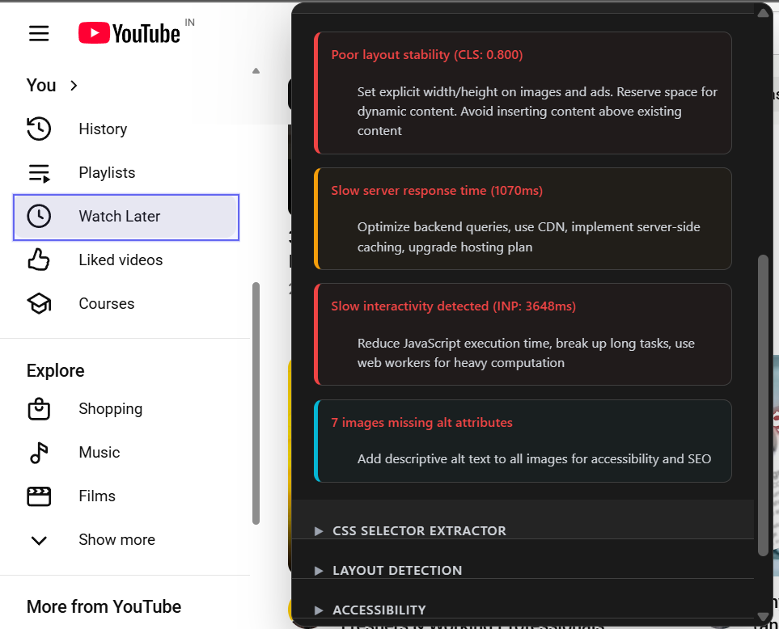
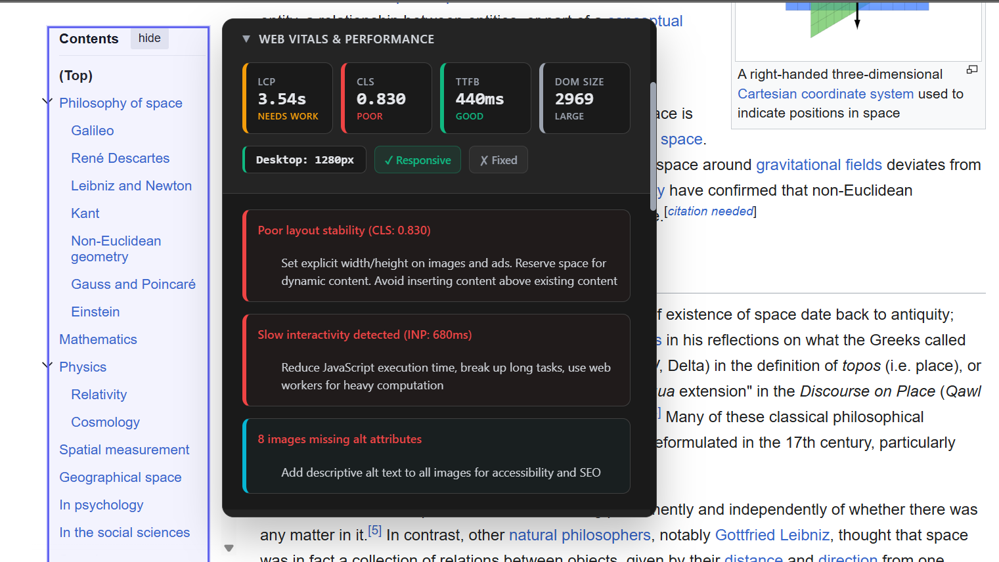
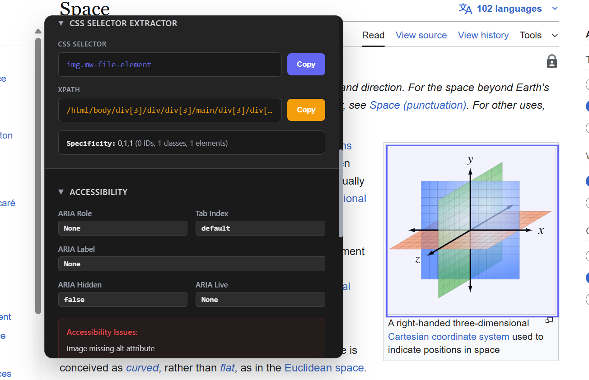
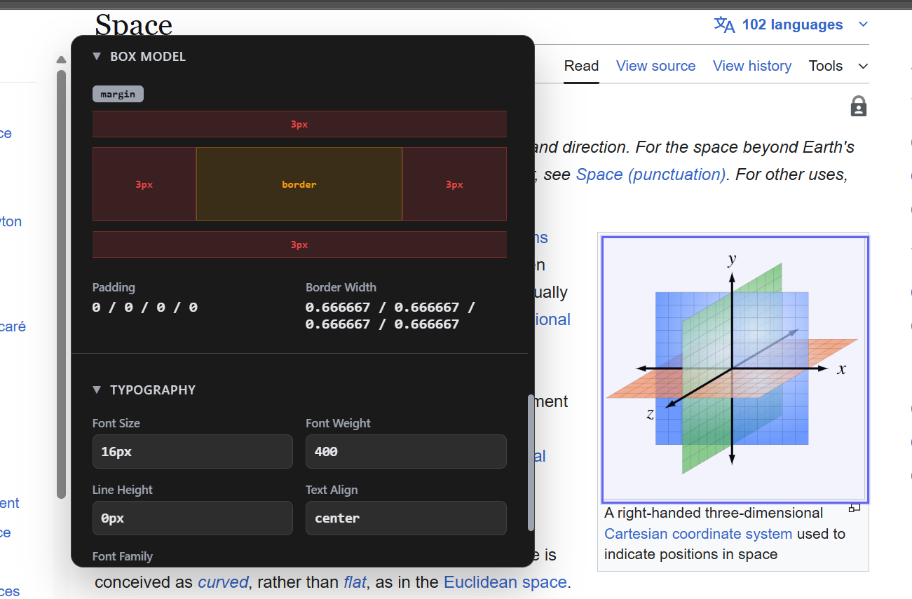

# DevInspect 🔍

> **Frontend Inspection Tool** — Chrome Extension - Analyze layouts, CSS selectors, accessibility, and Web Vitals with a single click.

[](https://opensource.org/licenses/MIT)


<div align="center">
  <strong>Inspect elements • Extract selectors • Audit accessibility • Monitor performance</strong>
</div>

---

## ✨ Features

### 🎯 Element Inspection
- **Interactive hover inspection** — Move your cursor to inspect any element
- **Detailed element info** — View DOM hierarchy, computed styles, and box model
- **CSS selector extraction** — Get unique selectors (ID, class, XPath)
- **Layout detection** — Automatically identify Flexbox & Grid layouts with visual guides
- **Visual highlighting** — Clean, non-intrusive overlay on inspected elements

### 🌐 Web Performance
- **Core Web Vitals tracking** — LCP, CLS, FID, INP, TTFB in real-time
- **Performance metrics** — Total nodes, images, scripts, stylesheets analysis
- **Smart warnings** — Actionable recommendations for performance issues
- **Per-page caching** — 5-second cache for optimal performance

### ♿ Accessibility Audits
- **WCAG contrast ratio checker** — Verify text/background color compliance
- **Touch target validation** — Check minimum 44x44px tap target sizes
- **Font size verification** — Ensure minimum 12px readable text
- **ARIA label detection** — Identify missing accessibility attributes
- **Accessibility warnings** — Real-time feedback on accessibility issues

### 🎨 User Experience
- **Dark/Light theme** — Automatic OS preference detection or manual toggle
- **Responsive design** — Works seamlessly on all screen sizes
- **Onboarding flow** — First-time user welcome & feature guide
- **Draggable panels** — Customizable inspector panel positioning
- **ESC key support** — Quick panel dismissal

---

## 📸 Screenshots

### Extension popup overview


### Web Vitals & performance on YouTube


### Performance insights & warnings


### Web Vitals on Wikipedia


### CSS selector extraction & accessibility checks


### Box model & typography inspector



## 🚀 Quick Start

### Installation

#### Option 1: Chrome Web Store (Coming Soon)
1. Visit [DevInspect on Chrome Web Store](https://chrome.google.com/webstore)
2. Click **Add to Chrome**
3. Confirm permissions

#### Option 2: Manual Installation (Development)
1. Clone the repository:
   ```bash
   git clone https://github.com/preranah7/devinspect.git
   cd devinspect
   ```

2. Install dependencies:
   ```bash
   npm install
   ```

3. Build the extension:
   ```bash
   npm run build
   ```

4. Load in Chrome:
   - Open `chrome://extensions/`
   - Enable **Developer mode** (top-right)
   - Click **Load unpacked**
   - Select the `dist/` folder

---

## 📖 Usage

### Getting Started
1. **Open DevInspect** — Press the extension icon in your toolbar
2. **Activate Inspector** — Click "Activate Inspector" button or press Ctrl+Shift+I
3. **Hover & Inspect** — Move your cursor over any element to inspect
4. **View Details** — Check layout, accessibility, performance, and CSS info
5. **Copy Selectors** — Click selector buttons to copy to clipboard

### Inspector Panel
- **Layout Section** — Visual Flexbox/Grid guides with gap & alignment info
- **CSS Selectors** — Copy ID, class-based, XPath, or unique selectors
- **Web Vitals** — Page-level performance metrics with severity indicators
- **Accessibility** — WCAG compliance scores and specific issues
- **Warnings** — Actionable recommendations for improvement

### Keyboard Shortcuts
| Shortcut | Action |
|----------|--------|
| `Ctrl+Shift+I` | Toggle inspector |
| `ESC` | Close inspector panel |
| `Click selector button` | Copy to clipboard |

---

## 🛠️ Tech Stack

| Layer | Technologies |
|-------|--------------|
| **Frontend** | TypeScript, Vite, Vanilla JS |
| **Styling** | CSS3, CSS Variables (theme system) |
| **Build** | Vite + @crxjs/vite-plugin |
| **Architecture** | Modular content scripts, popup UI, theme management |
| **APIs** | Chrome Extension APIs, Performance Observer, PerformanceObserver |

### Project Structure
```
devinspect/
├── src/
│ ├── content/
│ │ ├── index.ts                                       # Content script entry
│ │ ├── modules/                                       # Core inspection logic
│ │ │ ├── accessibility.ts                             # WCAG/accessibility checks
│ │ │ ├── inspector.ts                                 # Element inspection
│ │ │ ├── layout.ts                                    # Flexbox/Grid detection
│ │ │ ├── panel.ts                                     # Inspector panel UI
│ │ │ ├── performance.ts                               # Web Vitals & metrics
│ │ │ ├── responsive.ts                                # Responsive helpers
│ │ │ ├── selectors.ts                                 # CSS selector extractor
│ │ │ ├── state.ts                                     # State & caching
│ │ │ ├── theme.ts                                     # Dark/Light theme
│ │ │ ├── utils.ts                                     # Shared utilities
│ │ │ └── index.ts                                     # Module barrel file
│ │ └── types/
│ │ └── index.ts                                       # TypeScript types
│ ├── popup/
│ │ ├── popup.html                                     # Popup markup
│ │ ├── popup.css                                      # Popup styles
│ │ └── popup.js                                       # Popup logic
│ ├── styles/
│ │ └── content.css                                    # In-page overlay styles
│ ├── manifest.json                                    # Chrome extension manifest
│ └── index.ts                                         # Main entry point
├── public/
│ └── icons/                                           # Extension icons & theme glyphs
│ ├── icon16.png
│ ├── icon48.png
│ ├── icon128.png
│ ├── moon.svg
│ └── sun.svg
├── screenshots/                                       # README & store screenshots
│ ├── popup-ui.png.jpg
│ ├── web-vitals-youtube.png.jpg
│ ├── performance-warnings.png.jpg
│ ├── web-vitals-wiki.png.jpg
│ ├── css-selector-accessibility.png.jpg
│ └── box-model.png.jpg
├── dist/                                              # Production build (generated)
├── node_modules/                                      # Dependencies
├── .gitignore                                         # Git ignore rules
├── LICENSE                                            # MIT license
├── PRIVACY.md                                         # Privacy policy
├── package.json                                       # Scripts & dependencies
├── package-lock.json                                  # Locked dependency tree
├── tsconfig.json                                      # TypeScript config
├── vite.config.ts                                     # Vite build config
└── README.md                                          # Project documentation
```

---

## 💻 Development

### Prerequisites
- Node.js >= 16.0.0
- npm >= 8.0.0
- Chrome/Chromium browser

### Setup
```bash
# Clone repository
git clone https://github.com/preranah7/devinspect.git
cd devinspect

# Install dependencies
npm install

# Start development server
npm run dev

# Load in Chrome:
# 1. chrome://extensions/
# 2. Enable "Developer mode"
# 3. Click "Load unpacked" → select dist/ folder
# 4. Make changes, save → refresh extension (Ctrl+R)
```

### Development Workflow
```bash
# Development mode (watch & rebuild)
npm run dev

# Production build (minified, optimized)
npm run build

# Preview production build
npm run preview
```

### Code Quality
- **TypeScript** — Strict mode enabled for type safety
- **Modular architecture** — Separated concerns (state, UI, logic, styles)
- **Error handling** — Try/catch blocks with console logging
- **Performance optimized** — Debouncing, caching, efficient DOM queries

---

## 🧪 Testing

### Manual Testing Checklist
- [ ] Inspector activates with keyboard shortcut (Ctrl+Shift+I)
- [ ] Elements highlight correctly on hover
- [ ] All selector types work (ID, class, XPath, custom)
- [ ] Web Vitals display correctly on page load
- [ ] Accessibility checks return accurate results
- [ ] Layout detection works on Flexbox & Grid elements
- [ ] Dark/Light theme toggles properly
- [ ] Panel closes with ESC key
- [ ] Works on major sites (Amazon, YouTube, etc.)

### Console Debugging
```javascript
// Check if DevInspect is loaded
console.log('[DevInspect] Extension initialized');

// Verify inspector state
console.log('[DevInspect Inspector] Active');

// Performance metrics
console.log('[DevInspect Performance] Web Vitals:', vitals);
```

---

## 📦 Build & Distribution

### Production Build
```bash
# Create optimized build
npm run build

# Check dist/ folder for:
# ✓ manifest.json
# ✓ All JS/CSS files minified
# ✓ Icons in place
# ✓ No source maps (optional)
```

### Package for Chrome Web Store
```bash
# Zip the dist/ folder
cd dist
powershell Compress-Archive -Path * -DestinationPath ../devinspect-v1.0.0.zip

# Upload to Chrome Web Store:
# 1. Go to https://chrome.google.com/webstore/developer/
# 2. Click "New item"
# 3. Upload ZIP file
# 4. Fill in store listing (description, screenshots, privacy policy)
# 5. Submit for review
```

### Bundle Size
- **Total**: ~450KB (uncompressed)
- **Gzipped**: ~100KB (production download)
- **Breakdown**:
  - JS: 33KB
  - CSS: 20KB
  - Icons: 387KB
  - HTML: 3KB

---

## 🔐 Privacy & Security

### Data Handling
- **No external calls** — All analysis happens locally in your browser
- **No data collection** — Nothing sent to servers or third parties
- **No cookies** — Extension doesn't use cookies or tracking
- **Local storage only** — Preferences stored in browser memory

### Permissions
- `activeTab` — Required to inspect current page elements
- `scripting` — Allows content script injection for element inspection
- `<all_urls>` — Works on any webpage you visit

For detailed privacy information, see [PRIVACY.md](./PRIVACY.md).

---

## 📝 Features Roadmap


### v1.1 (Future)
- [ ] Integration with DevTools
- [ ] Real-time collaboration mode
- [ ] Advanced filtering options
- [ ] Export reports (HTML/PDF)
- [ ] Dark mode refinements

---

## 🤝 Contributing

We welcome contributions! Here's how to help:

### Report Issues
Found a bug? [Open an issue](https://github.com/preranah7/devinspect/issues)

Include:
- Chrome/Chromium version
- Website where issue occurred
- Steps to reproduce
- Expected vs actual behavior
- Console errors (if any)

### Submit Improvements
1. Fork the repository
2. Create feature branch: `git checkout -b feature/amazing-feature`
3. Commit changes: `git commit -m 'Add amazing feature'`
4. Push branch: `git push origin feature/amazing-feature`
5. Open a [Pull Request](https://github.com/preranah7/devinspect/pulls)

### Code Standards
- TypeScript strict mode enforced
- Modular architecture required
- Add JSDoc comments for complex functions
- Test on multiple websites before submitting
- Follow existing code style

---

## 📄 License

This project is licensed under the **MIT License** — see [LICENSE](./LICENSE) file for details.

### Commercial Use
✅ Allowed — Feel free to use this in commercial projects or redistribute
⚠️ Attribution — Not required, but appreciated

---

## 👨‍💻 Author

**DevInspect** — Built with ❤️ for frontend developers.

- **Creator**: [Prerana Hippargi](https://github.com/preranah7)
- **Repository**: [github.com/preranah7/devinspect](https://github.com/preranah7/devinspect)
- **Issues**: [Report a bug](https://github.com/preranah7/devinspect/issues)

---

## 📚 Resources

- [Chrome Extension API Docs](https://developer.chrome.com/docs/extensions/reference/)
- [Web Vitals Documentation](https://web.dev/vitals/)
- [WCAG Accessibility Standards](https://www.w3.org/WAI/WCAG21/quickref/)
- [MDN Web Docs](https://developer.mozilla.org/)

---

## ⭐ Acknowledgments

- Built with [Vite](https://vitejs.dev/) for fast development
- TypeScript for type safety
- Chrome DevTools for inspiration
- Community feedback and contributions

---

<div align="center">

**Built to make frontend development faster, easier, and more accessible.**

[Report Issue](https://github.com/preranah7/devinspect/issues) • [Contribute](https://github.com/preranah7/devinspect/pulls) • [Documentation](./PRIVACY.md)

⭐ If you find DevInspect helpful, please star the repository!

</div>
